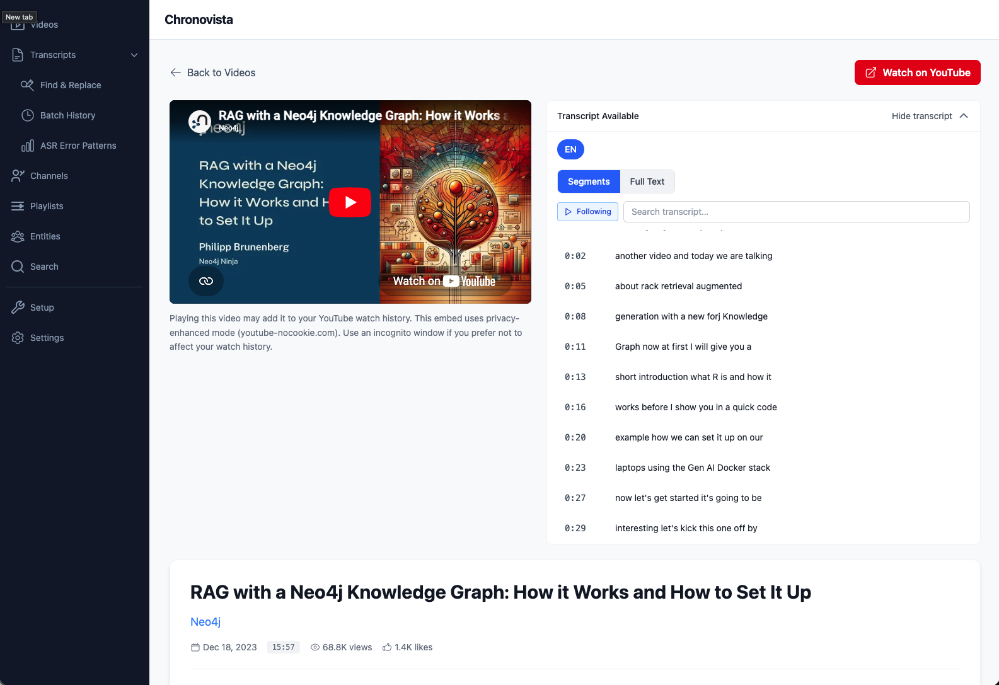

<h1 align="center">chronovista</h1>

<p align="center">
  <strong>A CLI + web dashboard for your YouTube history. Sync watch history, search transcripts by timestamp, recover deleted videos, and explore 147,000+ canonical tags — all stored privately in local PostgreSQL.</strong>
</p>

<p align="center">
  <a href="https://github.com/aucontraire/chronovista/actions/workflows/test.yml"></a>
  <a href="https://aucontraire.github.io/chronovista/"></a>
  
  
  
  
  
</p>

<p align="center">
  <a href="#engineering-highlights">Engineering</a> |
  <a href="#features">Features</a> |
  <a href="#quick-start">Quick Start</a> |
  <a href="#usage">Usage</a> |
  <a href="#architecture">Architecture</a> |
  <a href="#development">Development</a> |
  <a href="https://aucontraire.github.io/chronovista/">Docs</a>
</p>

---

<p align="center">
  
</p>

## Engineering Highlights

- **11,400+ tests** (7,761 backend + 3,641 frontend) across 229 backend source files with **mypy strict mode, zero errors**
- **56 releases** under a **versioned constitutional engineering framework** with anti-slop guardrails ([see constitution.md](.specify/memory/constitution.md))
- **Async-first architecture** with full `async/await` through 75 FastAPI endpoints (asyncpg, httpx) and 94 CLI commands
- **Tag normalization** reducing 621,000+ raw tags to 147,000+ canonical forms via a 9-step Unicode pipeline with fuzzy search and 168,000+ alias mappings
- **Named entity detection** across transcripts, titles, and descriptions — 259 entities, 139,000+ mentions, with longest-match-wins disambiguation and exclusion patterns
- **Wayback Machine recovery** via CDX API for metadata of deleted YouTube videos — three-tier overwrite policy, retry with backoff, era-anchored search
- **Transcript correction system** — append-only audit trail with inline edit/revert/history, batch find-replace, ASR error pattern detection (3,800+ corrections applied)
- **1.46 million transcript segments** across 50+ languages with quality hierarchy (manual CC > professional > auto-synced > ASR)
- **Full-stack TypeScript strict** — React 19 + TypeScript 5.7 strict + TanStack Query v5 + Tailwind CSS 4
- **Repository pattern** with composite key support, isolating all DB access from business logic across 24 tables and 34 Alembic migrations
- **CI/CD** via GitHub Actions — 4-job pipeline (unit tests, mypy strict + ruff, frontend tests + TS check, integration tests with PostgreSQL)

## Why This Exists

I built chronovista as the data infrastructure layer for a larger research project: extracting and synthesizing knowledge from YouTube interview transcripts across politics, economics, history, and technology. To do that reliably, I needed accurate transcripts (YouTube ASR has errors — I've manually corrected 3,800+ so far), complete metadata (Google Takeout is sparse and doesn't preserve deleted videos), and normalized tagging across hundreds of channels.

Every feature exists because I hit a real limitation while doing that research. The transcript correction system came from manually fixing the same ASR errors repeatedly. The Wayback Machine recovery came from needing context on channels whose old content had disappeared. The tag normalization came from realizing that "mejico", "mexiko", and "Mexico" all needed to map to the same canonical entity. The named entity detection came from wanting to see every video where a specific person was mentioned — across transcripts, titles, descriptions, and tags — without manually searching each source. Build-as-you-need rather than design-up-front, across 56 incremental releases.

## Features

| Category | Capabilities |
|----------|-------------|
| **Local-First Privacy** | All data in local PostgreSQL — no cloud sync, complete data ownership |
| **Multi-Language Transcripts** | 50+ languages with personal preferences (fluent, learning, curious, exclude) |
| **Transcript Search** | Timestamp-based queries with context windows — find what was said at any moment |
| **Transcript Corrections** | Inline edit/revert with append-only audit trail, batch find-replace, ASR error detection |
| **Tag Intelligence** | 147K canonical tags from 621K raw variations, fuzzy search, 7 curation CLI commands |
| **Named Entity Detection** | Multi-source entity mentions (transcript + title + description + tag), alias matching, exclusion patterns |
| **Channel Analytics** | Subscription tracking, keyword extraction, topic analysis across 9,600+ channels |
| **Google Takeout** | Import complete YouTube history including deleted/private videos |
| **Deleted Video Recovery** | Recover metadata for unavailable videos via the Wayback Machine CDX API |
| **REST API + Web UI** | FastAPI server (75 endpoints) with React dashboard for browsing, filtering, and entity exploration |
| **One-Command Deploy** | `docker compose up` — full stack with guided onboarding, no Python/Node.js required |
| **Write Operations** | Create playlists, like videos, subscribe to channels via OAuth |
| **Export** | CSV/JSON with language-aware filtering |

### What This Isn't

chronovista is not a multi-user service, not cloud-hosted, and not a YouTube analytics competitor. It's a personal research instrument — a single-user local tool for deep analysis of your own YouTube engagement data.

### Tech Stack

- **Backend:** Python 3.11+, FastAPI, SQLAlchemy 2.0 (async), Alembic, Typer, Pydantic V2
- **Frontend:** React 19, TypeScript 5.7 (strict), TanStack Query v5, Tailwind CSS 4
- **Database:** PostgreSQL 15 via asyncpg (24 tables, 34 migrations)
- **Auth:** Google OAuth 2.0 with progressive scope management
- **CI:** GitHub Actions (mypy strict, ruff, pytest, vitest, TypeScript check)

## Quick Start

```bash
# Clone
git clone https://github.com/aucontraire/chronovista.git
cd chronovista

# Configure
cp .env.example .env  # Add YouTube API credentials

# One-time OAuth setup (must run natively)
pip install chronovista  # or: poetry install
chronovista auth login

# Start the stack
make docker-setup
# Opens http://localhost:8765/onboarding
```

<details>
<summary>Development Setup (alternative)</summary>

```bash
# Clone and install
git clone https://github.com/aucontraire/chronovista.git
cd chronovista && poetry install

# Setup database (Docker Compose, port 5434)
make dev-db-up
cp .env.example .env  # Add YouTube API credentials, set DEVELOPMENT_MODE=true
make dev-migrate

# Authenticate and sync
poetry run chronovista auth login
poetry run chronovista sync all
# Or activate the virtualenv first: poetry shell
```
</details>

## Installation

### Docker (Recommended)

The fastest way to get running. No Python or Node.js installation required.

**Prerequisites:** Docker with Compose, [YouTube Data API credentials](https://console.cloud.google.com/) (API key + OAuth client).

**One-time OAuth setup:** The container handles token refresh, but the initial OAuth login requires a native install so the browser redirect works:

```bash
pip install chronovista  # or: poetry install
chronovista auth login
```

**Start the stack:**

```bash
cp .env.example .env       # Add YouTube API credentials
make docker-setup          # Validates, builds, starts, health check
# Opens http://localhost:8765/onboarding
```

The guided onboarding wizard walks you through a 4-step pipeline:

1. **Seed Reference Data** — load topic categories and region mappings
2. **Load Data Export** — import your Google Takeout YouTube history
3. **Enrich Metadata** — fetch current metadata from the YouTube API
4. **Normalize Tags** — build canonical tag mappings from raw tag variations

**Run CLI commands inside the container:**

```bash
make docker-shell          # Opens bash inside the container
chronovista sync all       # Run any CLI command
```

**Other Makefile commands:** `make docker-up`, `make docker-down`, `make docker-restart`, `make docker-logs`, `make docker-status`, `make docker-db-shell`, `make docker-clean`.

**Adding new Takeout data:** Drop the export into `./takeout/`, refresh the onboarding page, and click Start. Data persists in Docker volumes; the OAuth token persists in `./data/`.

See [Migrating from Native to Docker](docs/guides/migrating-to-docker.md) for a detailed migration guide.

### What Runs Where

Docker is for **using** chronovista. Native Python is for **developing** chronovista. The `chronovista auth` commands are the one exception — they must always run natively because the OAuth flow requires a browser redirect to `localhost` on your machine.

| Command | Where | Why |
|---------|-------|-----|
| `chronovista auth login/logout/status` | **Host (natively)** | Browser redirect needs host access |
| All other `chronovista` commands | **Container** (`make docker-shell`) | Full stack runs inside Docker |
| `make docker-*` commands | **Host** | Docker management |
| `make dev`, `make test`, `make quality` | **Host (natively)** | Development workflow |

> **Note:** If you're only using chronovista (not developing it), you only need Docker and a one-time native `chronovista auth login`. Everything else happens through the web UI or `make docker-shell`.

### Development Prerequisites

For local development (contributors, not end users):

- Python 3.11+
- [Poetry](https://python-poetry.org/)
- Docker (with Compose, for the development database)
- [YouTube Data API credentials](https://console.cloud.google.com/) (API key + OAuth client)

### Install

```bash
git clone https://github.com/aucontraire/chronovista.git
cd chronovista
poetry install
```

### Database Setup

```bash
# Start development database (Docker Compose, port 5434)
make dev-db-up

# Configure environment
cp .env.example .env  # Add YouTube API credentials, set DEVELOPMENT_MODE=true

# Run migrations
make dev-migrate
```

### YouTube API Setup

You'll need a Google Cloud project with YouTube Data API v3 enabled and OAuth 2.0 credentials.

**[Full setup guide](docs/getting-started/youtube-api-setup.md)** — covers consent screen configuration, test user setup, and common authentication errors.

Quick reference for `.env`:
```env
YOUTUBE_API_KEY=your_api_key
YOUTUBE_CLIENT_ID=your_client_id
YOUTUBE_CLIENT_SECRET=your_client_secret
```

## Usage

### Authentication

```bash
chronovista auth login     # OAuth login
chronovista auth status    # Check status
chronovista auth logout    # Logout
```

### Sync Your Data

```bash
chronovista sync history      # Watch history
chronovista sync playlists    # Playlists
chronovista sync transcripts  # Video transcripts
chronovista sync topics       # Topic categories
chronovista sync all          # Everything
```

### Transcript Queries

```bash
chronovista transcript segment VIDEO_ID 5:00      # Get segment at timestamp
chronovista transcript context VIDEO_ID 5:00      # Get 30s context window
chronovista transcript range VIDEO_ID 1:00 5:00   # Get segments in range
chronovista transcript range VIDEO_ID 0:00 10:00 --format srt  # SRT export
```

### Topic Analytics

```bash
chronovista topics list              # All topics with content counts
chronovista topics popular           # Most popular by content
chronovista topics videos 10         # Videos in Music category
chronovista topics trends            # Popularity over time
chronovista topics chart             # Visual ASCII chart
chronovista topics explore           # Interactive exploration
```

### Tag Management

```bash
chronovista tags normalize --incremental           # Normalize only new tags
chronovista tags merge mejico mexiko --into mexico  # Merge spelling variants
chronovista tags split mexico --aliases "Mexican"   # Split incorrectly merged tags
chronovista tags rename mexico --to "Mexico"        # Change display form
chronovista tags classify mexico --type place       # Assign entity type
chronovista tags classify "destiny" --link-entity "Steven Bonnell"  # Link tag to existing entity
chronovista tags collisions                         # Review diacritic collision candidates
chronovista tags undo OPERATION_ID                  # Reverse any operation
```

### Entity Management

```bash
chronovista entities create "Norman Finkelstein" --type person  # Create entity
chronovista entities scan --sources transcript,title,description  # Multi-source detection
chronovista entities scan --entity-id UUID --full  # Full rescan for one entity
chronovista entities stats                          # Entity mention statistics
```

### Google Takeout Import

Import your complete YouTube history from [Google Takeout](https://takeout.google.com/):

```bash
chronovista takeout seed /path/to/takeout              # Full import
chronovista takeout seed /path/to/takeout --dry-run    # Preview changes
chronovista takeout seed /path/to/takeout --incremental # Safe re-run
chronovista takeout analyze /path/to/takeout           # Analyze patterns
```

<details>
<summary>Takeout Details</summary>

**What gets imported:**
- Channels, videos, and watch history with timestamps
- All playlists with video relationships
- Historical data including deleted/private videos

**Analysis commands:**
```bash
chronovista takeout peek /path/to/takeout --summary
chronovista takeout analyze /path/to/takeout --type viewing-patterns
chronovista takeout analyze /path/to/takeout --type channel-relationships
chronovista takeout inspect /path/to/takeout --focus playlists
```

**Combine with API data:**
```bash
chronovista takeout seed /path/to/takeout
chronovista sync all  # Enriches with current API data
```
</details>

### Recover Deleted Videos

Recover metadata for deleted or unavailable videos from the [Wayback Machine](https://web.archive.org/):

```bash
chronovista recover video --video-id VIDEO_ID                # Single video
chronovista recover video --all --limit 50                   # Batch recover
chronovista recover video --all --dry-run                    # Preview changes
chronovista recover video --video-id VIDEO_ID --start-year 2018  # Anchor to era
```

<details>
<summary>Recovery Details</summary>

**What gets recovered:**
- Title, description, upload date, channel info
- Tags, category, thumbnail URL
- View count, like count

**How it works:**
- Queries the Wayback Machine CDX API for archived YouTube video pages
- Extracts metadata from JSON or HTML meta tags
- Three-tier overwrite policy protects existing data
- Results cached locally for 24 hours

**Options:**
- `--start-year` / `--end-year` — Focus search on a specific archive era
- `--delay` — Rate limiting between videos in batch mode (default: 1s)
- `--dry-run` — Preview without making database changes
</details>

### REST API

Start the REST API server for programmatic access:

```bash
chronovista api start --port 8765    # Start server

# Example requests (requires prior auth login)
curl http://localhost:8765/api/v1/health
curl http://localhost:8765/api/v1/videos?limit=10
curl "http://localhost:8765/api/v1/search/segments?q=keyword"

# Interactive API docs
open http://localhost:8765/docs
```

### Web Frontend

```bash
make dev               # Start backend (8765) + frontend (8766)
open http://localhost:8766
```

The React dashboard provides video browsing with tag/category/topic filters, transcript search with inline corrections, playlist navigation, entity detail pages with multi-source mention aggregation, deleted video visibility controls, and a guided data onboarding wizard at `/onboarding`.

## Architecture

```
chronovista/
├── api/              # FastAPI REST API: 75 endpoints, RFC 7807 errors, rate limiting
├── cli/              # Typer CLI: 94 commands (auth, sync, topics, recovery, tags, entities)
├── services/         # Business logic: sync orchestration, tag normalization, entity detection
│   ├── enrichment/   # YouTube API enrichment with priority-tier selection
│   └── recovery/     # Wayback Machine recovery: CDX client, HTML parser, orchestrator
├── repositories/     # Async SQLAlchemy DAL: all DB access, composite key support
├── models/           # Pydantic V2 domain models (separate from ORM models in db/)
├── db/               # SQLAlchemy ORM models + 34 Alembic migrations across 24 tables
└── auth/             # OAuth 2.0 with progressive scope management
```

**Key design decisions:**
- Async-first with full async/await (asyncpg, httpx)
- Strict type safety: Pydantic V2 models + mypy strict mode (zero errors)
- Repository pattern isolating all database access
- Layered architecture: CLI/API -> Services -> Repositories -> DB

See [Architecture Overview](docs/architecture/overview.md) for details.

## Engineering Practice

chronovista is built under a versioned constitutional engineering framework that enforces production standards on AI-collaborated code: strict typing (mypy strict, zero `Any`), Pydantic-first data modeling, repository pattern, test-driven quality gates, and explicit anti-slop constraints (minimal-diff principle, file/abstraction budgets, the Rule of Three for premature abstraction).

The constitution is a versioned governance document — see [`.specify/memory/constitution.md`](.specify/memory/constitution.md). It evolved through real post-mortems (e.g., v1.1.0 added Cross-Feature Data Contract Verification after integration bugs in Features 030-032 revealed a gap at the seam between features). A multi-tier sub-agent review workflow enforces compliance at PR time.

## Development

### Workflow

```bash
# Install dev dependencies
poetry install --with dev

# Start the full local stack
make dev               # Backend on :8765, frontend on :8766

# Before committing — run all checks
make quality           # format + lint + type-check
```

### Testing

Integration tests require the development database (`postgres-dev` on port 5434):

```bash
make dev-db-up         # Start dev database (required for integration tests)

make test              # All backend tests (7,761)
make test-cov          # With coverage
make test-fast         # Quick run

# Frontend tests (3,641)
cd frontend && npm test
```

**Total: 11,400+ tests** (7,761 backend + 3,641 frontend).

### Code Quality

```bash
make format            # black + isort
make lint              # ruff
make type-check        # mypy (strict, 0 errors across 229 source files)
```

### Database

```bash
make db-upgrade        # Run migrations
make db-revision       # Create new migration
```

### Frontend Development

```bash
make dev-backend       # Backend only (port 8765)
make dev-frontend      # Frontend only (port 8766)
make generate-api      # Regenerate TypeScript API client after backend model changes
```

See [`frontend/README.md`](frontend/README.md) for detailed frontend documentation.

<details>
<summary>All Makefile Commands</summary>

```bash
make help              # Show all commands
make install-dev       # Dev dependencies
make install-all       # All dependencies
make shell             # Poetry shell
make clean             # Clean artifacts
make env-info          # Environment info
make dev-db-admin      # Start pgAdmin (localhost:8081)
```
</details>

<details>
<summary>Integration Testing</summary>

```bash
# Full setup
make dev-full-setup

# Authenticate (one-time)
poetry run chronovista auth login

# Run integration tests
poetry run pytest tests/integration/api/ -v

# Reset if needed
make dev-full-reset
```

Tests validate the complete flow: YouTube API -> Pydantic models -> Database persistence.
</details>

<details>
<summary>Troubleshooting</summary>

**"No module named mypy":**
```bash
poetry install --with dev
```

**Poetry not found:**
```bash
curl -sSL https://install.python-poetry.org | python3 -
export PATH="$HOME/.local/bin:$PATH"
```

**Virtual environment issues:**
```bash
poetry env info
poetry env remove python
poetry install
```
</details>

## Roadmap

- [ ] Knowledge graph extraction layer over normalized transcript + tag + entity data
- [ ] Semantic transcript search using embeddings (currently full-text ILIKE with GIN trigram indexes)
- [ ] Transcript refresh — re-download improved YouTube ASR with correction reconciliation ([#126](https://github.com/aucontraire/chronovista/issues/126))
- [ ] Browser extension for real-time watch history capture

## Contributing

1. Fork the repository
2. Create a feature branch
3. Run `make quality` before committing
4. Submit a pull request

See [CONTRIBUTING.md](CONTRIBUTING.md) for guidelines.

## License

[AGPL-3.0](LICENSE)
