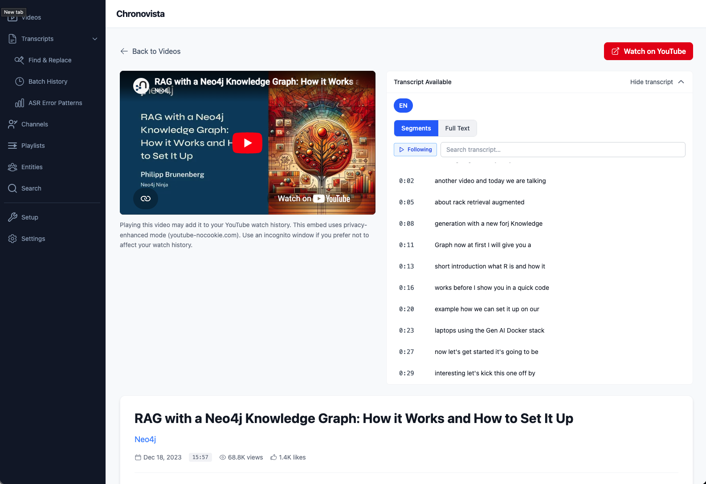

<h1 align="center">chronovista</h1>

<p align="center">
  <strong>A local-first research instrument for your own YouTube history.</strong><br>
  Archive watch history and transcripts, search by timestamp, recover deleted videos from the Wayback Machine,
  and canonicalize a decade of messy tags — entirely in PostgreSQL on your machine.
</p>

<p align="center">
  <a href="https://github.com/aucontraire/chronovista/actions/workflows/test.yml"></a>
  <a href="https://aucontraire.github.io/chronovista/"></a>
  <a href="https://github.com/aucontraire/chronovista/tags"></a>
  
  
  
</p>

<p align="center">
  <a href="#why-this-exists">Why</a> |
  <a href="#what-it-does">Features</a> |
  <a href="#quick-start">Quick Start</a> |
  <a href="#usage">Usage</a> |
  <a href="#architecture">Architecture</a> |
  <a href="#development">Development</a> |
  <a href="https://aucontraire.github.io/chronovista/">Docs</a>
</p>

---

<p align="center">
  
</p>

## Why This Exists

I built chronovista as the data infrastructure for a larger research project: extracting and synthesizing knowledge from YouTube interview transcripts across politics, economics, history, and technology.

Doing that reliably turned out to be harder than expected, for reasons that are structural rather than incidental:

- **YouTube's API forgets.** A [2025 audit in *Information, Communication & Society*](https://doi.org/10.1080/1369118X.2025.2591767) measured the decay: retrievable videos fall from roughly 450/day in the first 20 days after publication to about 20/day in the tail, and a case study repeated ten weeks later returned **76–92% fewer results** — for videos still live on the platform. If you want the record, you have to keep it yourself.
- **ASR transcripts are wrong in ways that matter.** Proper nouns especially. I've manually corrected more than 3,800 segments, which is what motivated an append-only correction system with a full audit trail rather than destructive edits.
- **Google Takeout is sparse**, and the videos that vanish are often the ones you most need context on — hence Wayback Machine recovery.
- **Tags are chaos.** "peruu", "peruvia", and "Peru" all point at one thing; "Peru" and "Peruvian" do not. That distinction has to survive normalization, which rules out naive case-folding.

Every feature exists because I hit one of these while doing the actual research. Build-as-you-need rather than design-up-front, across 61 tagged releases.

### What This Isn't

Not a multi-user service, not cloud-hosted, not a YouTube analytics competitor. It's a single-user local instrument for deep analysis of your own engagement data — no multi-tenancy, no per-user isolation, no cloud sync. That shapes the schema, and it isn't a gap to be filled later. If you want channel growth analytics, [vidIQ](https://vidiq.com/) and [TubeBuddy](https://www.tubebuddy.com/) solve a different problem well.

## What It Does

| Category | Capabilities |
|----------|-------------|
| **Local-First Privacy** | All data in local PostgreSQL — no cloud sync, complete ownership |
| **Transcript Search** | Timestamp-based queries with context windows — find what was said at any moment |
| **Transcript Corrections** | Inline edit/revert with an append-only audit trail, batch find-replace, ASR error-pattern detection |
| **Tag Canonicalization** | Collapse raw tag variants into canonical forms; fuzzy search, alias tracking, reversible curation (merge / split / classify / deprecate) |
| **Named Entity Mentions** | Alias-matched mentions across transcript, title, description, and tags, with longest-match disambiguation and exclusion patterns |
| **Deleted Video Recovery** | Reconstruct metadata for unavailable videos via the Wayback Machine CDX API |
| **Multi-Language Transcripts** | Per-language download preferences across a quality hierarchy (manual CC > professional > auto-synced > ASR) |
| **Channel Analytics** | Per-channel subscription tracking, keyword extraction, and topic analysis |
| **Google Takeout Import** | Full history including deleted and private videos |
| **Data Export** | Per-command CSV/JSON output (`--format`/`--output`) plus correction-audit export |
| **REST API + Web UI** | FastAPI server (81 endpoints) with a React dashboard for browsing, filtering, and entity exploration |
| **One-Command Deploy** | `docker compose up` — full stack with guided onboarding, no Python or Node.js required |

### Tech Stack

- **Backend:** Python 3.11+, FastAPI, SQLAlchemy 2.0 (async), Alembic, Typer, Pydantic V2
- **Frontend:** React 19, TypeScript 5.7 (strict), TanStack Query v5, Tailwind CSS 4
- **Database:** PostgreSQL 15 via asyncpg — 25 tables, 37 migrations
- **Auth:** Google OAuth 2.0 with progressive scope management
- **CI:** GitHub Actions — mypy strict, ruff, black, pytest, vitest, TypeScript check, integration tests against real PostgreSQL

## Scope and Limitations

Deliberate boundaries, stated up front:

- **Entity detection is alias matching, not statistical NER.** It finds entities you've registered — high precision, no discovery. The tradeoff is intentional for research use, where a false positive costs more than a miss, but it means the corpus can't surface people you didn't already know to look for. Statistical NER is [on the roadmap](#roadmap) as a complement.
- **Transcript retrieval uses an unofficial endpoint.** `youtube-transcript-api` reads `timedtext` rather than the Data API, because the official captions endpoint only exposes transcripts for videos you own or where third-party access is explicitly enabled — which most creators don't. It's rate-limited by IP in practice, so bulk retrieval needs pacing.

## Quick Start

```bash
git clone https://github.com/aucontraire/chronovista.git
cd chronovista
cp .env.example .env       # Add YouTube API credentials

# One-time OAuth setup — must run natively so the browser redirect reaches localhost
pip install .              # from the cloned repo (not yet on PyPI); or: poetry install
chronovista auth login

make docker-setup          # Validates, builds, starts, health-checks
# Opens http://localhost:8765/onboarding
```

The onboarding wizard walks through a four-step pipeline: seed reference data → load your Takeout export → enrich metadata from the YouTube API → normalize tags.

**Prerequisites:** Docker with Compose, and [YouTube Data API credentials](https://console.cloud.google.com/) (API key + OAuth client).

Setting up the Google Cloud project is the fiddliest step — the **[full setup guide](https://aucontraire.github.io/chronovista/getting-started/youtube-api-setup/)** covers consent screen configuration, test users, and the common authentication errors. Your `.env` needs three values:

```env
YOUTUBE_API_KEY=your_api_key
YOUTUBE_CLIENT_ID=your_client_id
YOUTUBE_CLIENT_SECRET=your_client_secret
```

<details>
<summary><b>Development setup (contributors)</b></summary>

```bash
git clone https://github.com/aucontraire/chronovista.git
cd chronovista && poetry install

make dev-db-up             # Dev PostgreSQL via Docker Compose, port 5434
cp .env.example .env       # Add credentials, set DEVELOPMENT_MODE=true
make dev-migrate

poetry run chronovista auth login
poetry run chronovista sync all
```

Requires Python 3.11+, [Poetry](https://python-poetry.org/), and Docker.
</details>

<details>
<summary><b>What runs where</b></summary>

Docker is for **using** chronovista; native Python is for **developing** it. The `auth` commands are the one exception — they always run natively, because the OAuth flow needs a browser redirect to `localhost` on your machine.

| Command | Where | Why |
|---------|-------|-----|
| `chronovista auth login/logout/status` | Host | Browser redirect needs host access |
| All other `chronovista` commands | Container (`make docker-shell`) | Full stack runs in Docker |
| `make docker-*` | Host | Docker management |
| `make dev`, `make test`, `make quality` | Host | Development workflow |

**Adding new Takeout data:** drop the export into `./takeout/`, refresh the onboarding page, click Start. Data persists in Docker volumes; the OAuth token persists in `./data/`.

See [Migrating from Native to Docker](docs/guides/migrating-to-docker.md) for details.
</details>

## Usage

```bash
# Authenticate, then sync your account
chronovista auth login
chronovista sync all

# Read what was said at a given moment, with surrounding context
chronovista transcript context dQw4w9WgXcQ 5:30

# Normalize and curate tags
chronovista tags normalize
chronovista tags merge "peruu" "peruvia" --into "Peru" --reason "spelling variants"

# Detect named entity mentions across transcripts, titles, descriptions, and tags
chronovista entities scan --full

# Recover deleted videos from the Wayback Machine
chronovista recover video --all --start-year 2018

# Collapse duplicate user identities (preview first)
chronovista identity repair --dry-run

# Start the REST API — interactive docs at /docs
chronovista api start --port 8765
```

The web dashboard — video browsing with tag/category/topic filters, transcript search with inline corrections, entity detail pages, and guided onboarding — runs at `http://localhost:8766` via `make dev`.

The full [CLI, REST API, and code reference](https://aucontraire.github.io/chronovista/reference/) is generated from source.

## Architecture

```
chronovista/
├── api/              # FastAPI REST API: 81 endpoints, RFC 7807 errors, rate limiting
├── cli/              # Typer CLI: 98 commands (auth, sync, topics, recovery, tags, entities)
├── services/         # Business logic: sync orchestration, tag normalization, entity detection
│   ├── enrichment/   # YouTube API enrichment with priority-tier selection
│   └── recovery/     # Wayback Machine recovery: CDX client, HTML parser, orchestrator
├── repositories/     # Async SQLAlchemy DAL: all DB access, composite key support
├── models/           # Pydantic V2 domain models (deliberately separate from ORM models)
├── db/               # SQLAlchemy ORM models + 37 Alembic migrations across 25 tables
└── auth/             # OAuth 2.0 with progressive scope management
```

**Design decisions:**

- **Async throughout** — full `async`/`await` over asyncpg and httpx, because this is an I/O-bound workload dominated by API calls and database round-trips.
- **Pydantic domain models separate from ORM models.** More boilerplate, but it keeps validation at the boundary and stops SQLAlchemy session semantics leaking into business logic.
- **Repository pattern** isolating all database access, generically typed including the primary key (`BaseSQLAlchemyRepository[Model, Create, Update, IdType]`) so composite keys stay type-safe.
- **Layered:** CLI/API → Services → Repositories → DB, with no upward dependencies.

See the [Architecture Overview](https://aucontraire.github.io/chronovista/architecture/overview/) for detail.

### Engineering Practice

The codebase holds production standards for AI-collaborated code, enforced in CI: strict typing (mypy strict, zero `Any` in public APIs), Pydantic-first modeling, the repository pattern with async I/O throughout, `black` and `ruff` formatting gates, and >90% test coverage. Anti-slop constraints are explicit — minimal diffs, file and abstraction budgets, and the Rule of Three against premature abstraction.

The standard that took longest to learn is **cross-feature data contract verification**. A mutation that changes data ownership must be re-queried through every downstream consumer path, and a mock test for an UPDATE must inspect the SQL `SET` clause rather than the return value — a column silently absent from `SET` returns success while writing nothing. This was added after integration bugs in Features 030–032 exposed a gap at the seam *between* features, where each side was individually correct. The tests enforcing it are in `tests/unit/api/test_entity_update_sql_columns.py` and `tests/integration/api/test_entity_rename_cross_feature.py`.

## Development

```bash
poetry install --with dev
make dev                   # Backend on :8765, frontend on :8766
make quality               # format + lint + type-check — run before committing
```

### Testing

Integration tests run against real PostgreSQL (`postgres-dev` on port 5434), not mocks or SQLite.

```bash
make dev-db-up             # Required for integration tests
make test                  # Backend suite
make test-cov              # With coverage
cd frontend && npm test    # Frontend suite
```

**11,800+ tests** across 239 backend source files, with **mypy strict passing at zero errors**. CI runs four jobs on every PR: backend unit tests, mypy strict + ruff + black, frontend tests + TypeScript check, and integration tests against a live PostgreSQL service container.

<details>
<summary><b>Other commands</b></summary>

```bash
make format            # black + isort
make lint              # ruff
make type-check        # mypy --strict
make db-upgrade        # Run migrations
make db-revision       # Create a migration
make dev-backend       # Backend only (:8765)
make dev-frontend      # Frontend only (:8766)
make generate-api      # Regenerate the TypeScript client after backend model changes
make help              # Everything else
```

See [`frontend/README.md`](frontend/README.md) for frontend specifics and the [development docs](https://aucontraire.github.io/chronovista/development/) for the full workflow.
</details>

<details>
<summary><b>Troubleshooting</b></summary>

**"No module named mypy":** `poetry install --with dev`

**Poetry not found:**
```bash
curl -sSL https://install.python-poetry.org | python3 -
export PATH="$HOME/.local/bin:$PATH"
```

**Virtual environment issues:**
```bash
poetry env info && poetry env remove python && poetry install
```
</details>

## Roadmap

- [ ] Knowledge graph extraction over normalized transcript, tag, and entity data
- [ ] Semantic transcript search using embeddings (currently full-text ILIKE with GIN trigram indexes)
- [ ] Statistical NER to complement alias matching, so unknown entities can be discovered
- [ ] Transcript refresh — re-download improved ASR with correction reconciliation ([#126](https://github.com/aucontraire/chronovista/issues/126))
- [ ] Write operations — create playlists, rate videos, manage subscriptions via OAuth write scopes
- [ ] Migration drift gate in CI ([#155](https://github.com/aucontraire/chronovista/issues/155))

## Contributing

Fork, branch, run `make quality`, open a PR. See [CONTRIBUTING.md](CONTRIBUTING.md).

## License

[AGPL-3.0](LICENSE)
