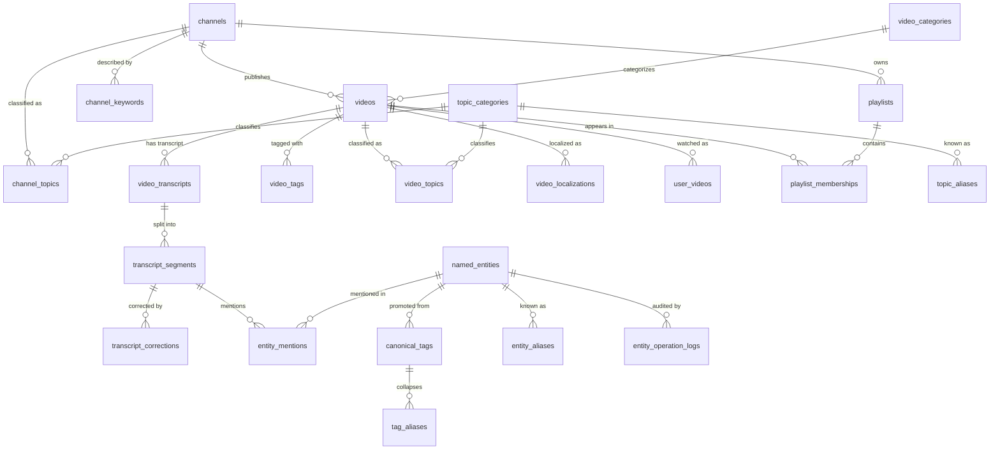

# Data Model

How the schema is organised and why. For the exhaustive per-table listing —
every column, type, constraint, and index — see the
**[Database Schema reference](../reference/schema.md)**, which is generated from
the SQLAlchemy models at build time.

## Entity Relationship Diagram

Foreign-key relationships between the main tables. Self-references
(`topic_categories`, `named_entities`, `canonical_tags`) express hierarchy and
merge lineage.

!!! note "app_identities is a logical key, not a foreign key"
    `user_videos.user_id` and `user_language_preferences.user_id` hold the
    canonical identity, but carry no database-level foreign key to
    `app_identities` — which is why they are absent from the diagram above. That
    one-identity invariant is maintained by the identity resolver and enforced by
    a cross-table contract test rather than by the schema.

## Table Groups

| Group | Tables | Purpose |
|-------|--------|---------|
| **Core Content** | `channels`, `videos`, `video_categories`, `video_localizations` | The content graph itself, plus YouTube's category reference data |
| **Transcripts** | `video_transcripts`, `transcript_segments`, `transcript_corrections` | Transcript text, per-segment timing, and the append-only correction audit trail |
| **User Data** | `app_identities`, `user_videos`, `user_language_preferences` | The local user's own engagement data, keyed by one canonical identity |
| **Playlists** | `playlists`, `playlist_memberships` | Playlists, including Takeout-imported system playlists |
| **Topics** | `topic_categories`, `topic_aliases`, `video_topics`, `channel_topics` | YouTube's topic taxonomy and its associations |
| **Tags and Normalization** | `video_tags`, `channel_keywords`, `canonical_tags`, `tag_aliases`, `tag_operation_logs` | Raw tags plus the canonical layer that collapses spelling variants |
| **Named Entities** | `named_entities`, `entity_aliases`, `entity_mentions`, `entity_operation_logs` | Curated entities, their aliases, and their video associations — text mentions plus hand-asserted manual links |
| **Recovery Provenance** | `video_recovery_sources`, `channel_recovery_sources` | Which archive sources contributed metadata to a deleted video or channel — append-only, so one pass cannot erase another's attribution ([why](recovery-provenance.md)) |

## Design Decisions

### Raw tags are never rewritten

`video_tags` stores exactly what YouTube returned. Normalization lives in a
parallel layer: `canonical_tags` holds one row per real concept, and
`tag_aliases` maps every observed spelling to it. Joining goes through
`tag_aliases.raw_form`.

Keeping the raw layer immutable makes normalization reversible — a merge that
turns out to be wrong is undone from `tag_operation_logs` without re-fetching
anything — and it preserves the distinction between spelling variants of one
concept ("peruu" → Peru) and genuinely different concepts (Peru ≠ Peruvian),
which a destructive rewrite would erase.

### Corrections are append-only

`transcript_corrections` never mutates the original ASR text. Each row records a
segment, its previous value, the new value, and who made the change, so any
correction can be reverted and a segment's full history reconstructed.
Re-downloading a transcript therefore cannot silently discard manual work.

### One definition of an entity's videos

An entity is linked to a video through five **provenance sources**: `manual`,
`transcript`, `title`, `description`, and `tag`. Four of them — the three
text-anchored *mentions* plus `manual` — live in `entity_mentions`, distinguished
by `mention_source`, which permits `manual` for a link the user asserts by hand
when the transcript never states it (rather than mislabelling it as a spoken
mention). The `tag` source comes through the `canonical_tags → named_entities`
link instead of `entity_mentions`.

Because the sources span two tables, a single shared resolver computes the
combined *distinct-video* count over all of them. The entity list, the entity
detail, and a video's entity panel all read that one resolver, so they report the
same `video_count` (with a per-source breakdown) rather than each counting a
different subset — which is what previously let the list show a mention-only
number while the detail showed the combined one.

### Knowledge-base enrichment lives on the entity row

A grounded entity carries two JSONB columns on `named_entities`. `external_ids` maps each
source (`wikidata`, `dbpedia`) to a structured record: the identifier, whether a human
verified it, whether the source was searched and found nothing, and how the link was
established. `properties` holds the grounded fact bag — occupation, country, dates, and the
rest — mirrored verbatim from the resolution pipeline rather than reshaped into rigid columns,
because the fact set is open and varies by entity type. Neither column is indexed for querying
yet: a facet is promoted to an index only when a surface actually filters on it.

The database is authoritative once the enrichment is loaded; the pipeline's export file is
historical. Grounding an entity in the app writes its identifier immediately and then fetches the
fact bag in the background — in the same verbatim shape the batch load produces, so a later load
neither conflicts with nor reshapes it. That on-approval fetch runs at create time only and writes
only the property bag (never the identifier or display fields); refreshing already-existing entities
remains the batch pipeline's job.

### One canonical user identity

Every table holding user-scoped data keys on a single identity, resolved once and
persisted in the `app_identities` singleton (`CHECK (id = 1)`). Identity is never
derived per-write from ambient authentication state — that is precisely what
previously split one person's watch history across a placeholder and a real
channel ID. See
[Identity Repair](../user-guide/cli-overview.md#identity-repair-v0600) for the
operator-facing command.

### UUIDv7 primary keys on the newer tables

The normalization and entity tables use UUIDv7 (`uuid_utils.uuid7()`) rather than
serial integers: they are time-ordered, so index locality stays good under
insert-heavy workloads, while remaining safe to generate outside a transaction.
PostgreSQL 15 has no native UUIDv7, so generation happens in Python.

### Pydantic models are separate from ORM models

`chronovista.models` (Pydantic V2) and `chronovista.db.models` (SQLAlchemy) are
deliberately distinct, and their field names are not guaranteed to match.
Validation stays at the boundary, and SQLAlchemy session semantics never leak
into business logic. Both are documented in the
[code reference](../reference/code/).

## See Also

- [Database Schema reference](../reference/schema.md) - every table, generated from the models
- [Architecture Overview](overview.md) - system context
- [System Design](system-design.md) - service layer
- [API Integration](api-integration.md) - YouTube API mapping
