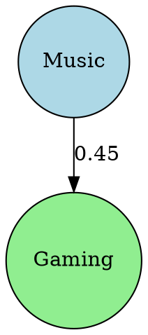

# Topic Integration Guide

A comprehensive guide to using chronovista's topic functionality for categorizing and filtering your YouTube content.

## Overview

chronovista integrates with YouTube's topic classification system to help you organize and explore your content by categories like News & Politics, Music, Gaming, Education, and more. Topics are automatically associated with your videos and channels during sync operations.

**✨ New in 2025**: Advanced analytics, interactive exploration, visual charts, and relationship analysis!

## Getting Started

### 1. Sync Topic Categories

First, populate the topic database with YouTube's standard categories:

```bash
chronovista sync topics
# Output: ✅ Topics: 0 created, 32 updated
```

This creates a local database of all YouTube topic categories (Music, Gaming, News & Politics, etc.).

### 2. Sync Content with Topic Associations

When you sync videos and channels, topic associations are automatically created:

```bash
# Sync liked videos with automatic topic linking
chronovista sync liked
# Output: ✅ Found 10 liked videos
#         🏷️ Creating topic associations...

# Sync channel info with topic associations
chronovista sync channel
# Output: ✅ Channel synced: Your Channel
#         🏷️ Processing channel topics...
```

## Topic Commands

### List All Topics

View all available topic categories:

```bash
chronovista topics list
```

### Show Topic Details

Get detailed information about a specific topic:

```bash
chronovista topics show 25
# Shows details for "News & Politics" topic
```

### Find Content by Topic

View videos associated with a topic:

```bash
chronovista topics videos 25
# Shows all your News & Politics videos
```

View channels associated with a topic:

```bash
chronovista topics channels 10
# Shows all your Music-related channels
```

### Advanced Analytics Commands (New in 2025)

#### Find Similar Topics

Discover topics with similar content patterns using cosine similarity:

```bash
# Find topics similar to Music (ID: 10)
chronovista topics similar 10

# Adjust similarity threshold and limit results
chronovista topics similar 10 --min-similarity 0.3 --limit 5
```

This command uses mathematical analysis to find topics that share similar video/channel distribution patterns, helping you discover related content categories.

#### Visual Topic Charts

Display topic popularity as ASCII bar charts:

```bash
# Show top topics by video count
chronovista topics chart

# Show by different metrics
chronovista topics chart --metric channels    # Rank by channel count
chronovista topics chart --metric combined    # Combined ranking

# Customize display
chronovista topics chart --limit 15 --width 50
```

Example output:
```
┌─ Topic Popularity Chart (Videos) ─┐
│                                   │
│ Music            ████████████ 847 │
│ Gaming           ██████████   623 │
│ Entertainment    ████████     456 │
│ Education        ██████       289 │
└───────────────────────────────────┘
```

#### Topic Relationship Trees

Visualize topic relationships in hierarchical trees:

```bash
# Show relationship tree for News & Politics
chronovista topics tree 25

# Customize tree depth and confidence
chronovista topics tree 25 --max-depth 3 --min-confidence 0.2

# Hide statistics for cleaner display
chronovista topics tree 25 --no-stats
```

Example output:
```
📊 News & Politics (25)
├── 📺 Related Topics
│   ├── 🏛️ Nonprofits & Activism (29) [confidence: 0.65]
│   ├── 📚 Education (27) [confidence: 0.43]
│   └── 📖 People & Blogs (22) [confidence: 0.31]
└── 📈 Statistics: 156 videos, 23 channels
```

#### Interactive Topic Exploration

Explore topics interactively with progress bars and guided workflow:

```bash
# Start interactive exploration
chronovista topics explore

# Auto-advance through topics (demo mode)
chronovista topics explore --auto-advance

# Disable analytics for faster browsing
chronovista topics explore --no-analytics
```

Features:
- **Multi-phase workflow**: Topic selection → Analytics → Action selection
- **Progress indicators**: Visual feedback during analysis
- **Rich formatting**: Professional tables and panels
- **Guided experience**: Clear instructions and options at each step

#### Discovery Pattern Analysis (Phase 3)

Analyze how users discover and engage with topics:

```bash
# Analyze discovery patterns across all topics
chronovista topics discovery

# Limit results and filter by discovery method
chronovista topics discovery --limit 10 --method liked_content

# Analyze discovery patterns with interaction requirements
chronovista topics discovery --min-interactions 5
```

Features:
- **Discovery Methods**: Analysis of liked_content, watched_complete, watched_partial, browsed
- **Retention Rates**: Shows which topics users continue consuming
- **Entry Topics**: Identifies topics most often discovered first
- **Engagement Scoring**: Average engagement levels per discovery method

#### Trend Analysis Over Time (Phase 3)

Track topic popularity changes across different time periods:

```bash
# Monthly trend analysis
chronovista topics trends

# Weekly trends with custom time range
chronovista topics trends --period weekly --months-back 6

# Filter trends by direction
chronovista topics trends --direction growing --limit 10
```

Features:
- **Time Periods**: Monthly, weekly, or daily analysis
- **Growth Tracking**: Growth rates compared to previous periods
- **Trend Filtering**: Focus on growing, declining, or stable topics
- **Visual Indicators**: Rich formatting with trend direction symbols

#### Personalized Topic Insights (Phase 3)

Get AI-powered recommendations based on viewing patterns:

```bash
# Generate insights for default user
chronovista topics insights

# Custom user analysis with limit
chronovista topics insights --user-id "your-channel-id" --limit 10
```

Insight Categories:
- **Emerging Interests**: Newly discovered topics showing growth potential
- **Dominant Interests**: Your primary topic preferences
- **Underexplored Topics**: Suggested areas for content exploration
- **Similar Recommendations**: Topics matching your current interests

#### Graph Visualization Export (Phase 3)

Export topic relationship data for advanced visualization:

```bash
# Export as DOT format for Graphviz
chronovista topics graph --format dot

# Export as JSON for D3.js or other tools
chronovista topics graph --format json --output network.json

# Customize graph complexity
chronovista topics graph --min-confidence 0.3 --limit 25
```

Supported Formats:
- **DOT**: For Graphviz visualization tools
- **JSON**: For web-based visualizations (D3.js, vis.js, etc.)
- **Metadata**: Includes confidence scores, shared content counts, timestamps

Usage Examples:
```bash
# Create PNG with Graphviz
dot -Tpng topic_graph.dot -o topic_network.png

# Use with online Graphviz viewers
# https://dreampuf.github.io/GraphvizOnline/
```

#### Heatmap Data Generation (Phase 3)

Generate temporal activity data for heatmap visualizations:

```bash
# Monthly activity heatmap
chronovista topics heatmap

# Daily activity with custom time range
chronovista topics heatmap --period daily --months-back 3

# Export to specific file
chronovista topics heatmap --output activity_data.json
```

Output includes:
- **Time-based Activity**: Content volume by time period
- **Topic Breakdown**: Activity levels per topic category
- **Metadata**: Period definitions, date ranges, generation timestamps
- **Visualization Ready**: Formatted for heatmap libraries

#### Engagement Analytics (Phase 3)

Analyze topic performance based on likes, views, and comments:

```bash
# Overall engagement analysis
chronovista topics engagement

# Focus on specific topic
chronovista topics engagement --topic-id "/m/04rlf"

# Sort by different metrics
chronovista topics engagement --sort-by avg_likes --limit 15
```

Metrics Provided:
- **Engagement Rate**: (likes + comments) / views percentage
- **Engagement Score**: Weighted 0-100 score across all metrics
- **Engagement Tiers**: High/Medium/Low performance classification
- **Average Metrics**: Likes, views, comments per topic

#### Channel Engagement Analysis (Phase 3)

Analyze how different channels perform within specific topics:

```bash
# Channel performance for Music topic
chronovista topics channel-engagement "/m/04rlf"

# Limit results to top performers
chronovista topics channel-engagement "/m/04rlf" --limit 5
```

Analysis includes:
- **Channel Rankings**: Sorted by total views with engagement rates
- **Performance Metrics**: Average and total engagement per channel
- **Comparative Analysis**: How channels perform relative to each other
- **Top Performer Insights**: Identify best-performing channels per topic

## Topic Filtering

### Filter Sync Operations

Only sync content matching specific topics:

```bash
# Only sync liked videos from News & Politics category
chronovista sync liked --topic 25

# Only sync channel if it matches the Music topic
chronovista sync channel --topic 10
```

### Filter Takeout Analysis

Apply topic filters to your Google Takeout analysis:

```bash
# Analyze takeout data grouped by topics
chronovista takeout analyze --by-topic

# Filter takeout analysis by specific topic
chronovista takeout analyze --topic 25

# Filter takeout peek by topic
chronovista takeout peek history --topic 10
```

## Common Topic Categories

Here are some frequently used YouTube topic IDs:

| ID | Category | Description |
|----|----------|-------------|
| 1  | Film & Animation | Movies, animations, film content |
| 2  | Autos & Vehicles | Car reviews, automotive content |
| 10 | Music | Songs, music videos, concerts |
| 15 | Pets & Animals | Animal videos, pet care |
| 17 | Sports | Sports highlights, games |
| 19 | Travel & Events | Travel vlogs, event coverage |
| 20 | Gaming | Video games, gaming content |
| 22 | People & Blogs | Personal vlogs, lifestyle |
| 23 | Comedy | Funny videos, comedy shows |
| 24 | Entertainment | General entertainment content |
| 25 | News & Politics | News, political commentary |
| 26 | Howto & Style | Tutorials, fashion, DIY |
| 27 | Education | Educational content, lectures |
| 28 | Science & Technology | Tech reviews, science content |

## How Topic Association Works

### Video Topics

Videos are linked to topics through their `categoryId` from the YouTube API:
- Each video has a primary topic category
- Association happens automatically during sync
- Stored as "primary" relevance type

### Channel Topics

Channels are associated with topics through YouTube's `topicDetails`:
- Channels may have multiple topic associations
- Only topics that exist in the database are linked
- Freebase topic IDs are gracefully handled (skipped if unknown)

## Error Handling

### Invalid Topic IDs

```bash
chronovista sync liked --topic 999
# Output: ❌ Invalid topic ID: 999
#         Use chronovista topics list to see available topics.
```

### No Matching Content

```bash
chronovista sync liked --topic 1
# Output: ℹ️ No videos found with topic ID: 1
#         Try a different topic or remove the --topic filter.
```

### Channel Topic Mismatch

```bash
chronovista sync channel --topic 25
# Output: ℹ️ Channel does not match topic ID: 25
#         Use chronovista sync channel without --topic to sync anyway.
```

## Best Practices

### 1. Regular Topic Sync

Update your topic categories periodically:

```bash
# Run this monthly to get any new categories
chronovista sync topics
```

### 2. Full Sync for Complete Coverage

Use full sync to ensure all content has topic associations:

```bash
chronovista sync all
# Syncs topics → channels → videos with all associations
```

### 3. Explore Before Filtering

List available topics before applying filters:

```bash
chronovista topics list
# See what categories you have content in
```

### 4. Targeted Analysis

Use topic filtering for focused analysis:

```bash
# Analyze only your educational content
chronovista takeout analyze --topic 27

# Focus on gaming content from takeout
chronovista takeout peek history --topic 20
```

## Advanced Usage

### Finding Your Content Distribution

```bash
# List topics with content counts
chronovista topics list

# Visual overview with charts
chronovista topics chart --metric combined

# Check which topics your channel covers
chronovista topics channels YOUR_TOPIC_ID
```

### Content Discovery

```bash
# Find all music videos you've liked
chronovista topics videos 10

# Discover educational channels you follow
chronovista topics channels 27

# Find topics similar to your favorites
chronovista topics similar 10 --min-similarity 0.4
```

### Topic Relationship Analysis

```bash
# Explore how topics connect to each other
chronovista topics tree 25 --max-depth 2

# Interactive exploration of topic patterns
chronovista topics explore

# Analyze content overlap between topics
chronovista topics similar 10 --limit 3
```

### Targeted Sync Workflows

```bash
# Sync only news content for focused analysis
chronovista sync liked --topic 25

# Keep entertainment content separate
chronovista sync liked --topic 24

# Use similar topics to find related content
chronovista topics similar 25 | head -3  # Get top 3 similar topics
```

## Troubleshooting

### Topics Not Showing Up

1. **Ensure topics are synced**: `chronovista sync topics`
2. **Sync content first**: `chronovista sync liked` or `chronovista sync channel`
3. **Check topic associations**: `chronovista topics videos TOPIC_ID`

### Filtering Returns No Results

1. **Verify topic ID**: `chronovista topics list`
2. **Check if you have content in that category**: `chronovista topics videos TOPIC_ID`
3. **Try without filters first**: `chronovista sync liked`

### Channel Topics Not Working

- Channel topic association depends on YouTube's API data
- Some channels may not have topic information
- Freebase topic IDs are filtered out (only standard YouTube categories are used)

## Technical Details

### Database Storage

- **Topic Categories**: Stored in `topic_categories` table
- **Video Topics**: Junction table `video_topics` with composite keys
- **Channel Topics**: Junction table `channel_topics`

### API Integration

- **Video Categories**: Extracted from `snippet.categoryId`
- **Channel Topics**: Extracted from `topicDetails.topicIds`
- **Validation**: All topic IDs validated against local database

### Type Safety

- Full mypy compliance
- Pydantic models for all topic data
- Robust error handling and validation

## Command Reference

### Core Topic Commands
- `chronovista topics list` - List all topic categories
- `chronovista topics show TOPIC_ID` - Show topic details
- `chronovista topics videos TOPIC_ID` - Show videos for topic
- `chronovista topics channels TOPIC_ID` - Show channels for topic

### Analytics Commands (New in 2025)
- `chronovista topics similar TOPIC_ID` - Find similar topics using cosine similarity
- `chronovista topics chart` - Display topic popularity as ASCII bar charts
- `chronovista topics tree TOPIC_ID` - Visualize topic relationships as trees
- `chronovista topics explore` - Interactive topic exploration with progress bars
- `chronovista topics discovery` - Analyze user discovery patterns and pathways
- `chronovista topics trends` - Analyze topic popularity trends over time
- `chronovista topics insights` - Generate personalized topic insights and recommendations
- `chronovista topics graph` - Export topic relationship graphs (DOT/JSON)
- `chronovista topics heatmap` - Generate topic activity heatmap data
- `chronovista topics engagement` - Analyze engagement metrics (likes, views, comments)
- `chronovista topics channel-engagement` - Channel engagement analysis for specific topics

### Related Commands
- `chronovista topics --help` - Full topic command help
- `chronovista sync --help` - Sync command options
- `chronovista takeout --help` - Takeout analysis options

## Technical Implementation

### Cosine Similarity Algorithm

The `topics similar` command uses advanced mathematical analysis:

1. **Content Pattern Analysis**: Calculates video-to-channel ratios for each topic
2. **Volume Normalization**: Considers total content volume differences
3. **Cosine Similarity**: Measures similarity using dot product and magnitude calculations
4. **Weighted Scoring**: Combines volume similarity (30%) and ratio similarity (70%)

### Engagement Scoring Algorithm (Phase 3)

The engagement analytics uses a weighted scoring system:

```python
# Weighted engagement score (0-100)
view_score = min(avg_views / 10000, 100) * 0.3    # 30% weight
like_score = min(avg_likes / 100, 100) * 0.4      # 40% weight  
comment_score = min(avg_comments / 10, 100) * 0.3 # 30% weight

engagement_score = view_score + like_score + comment_score
```

**Engagement Tiers:**
- **High**: Score ≥ 70 (excellent audience interaction)
- **Medium**: Score 40-69 (good engagement levels)
- **Low**: Score < 40 (room for improvement)

### Graph Export Formats (Phase 3)

**DOT Format** - For Graphviz visualization:


**JSON Format** - For web visualizations:
```json
{
  "nodes": [
    {"id": "/m/04rlf", "name": "Music", "size": 847, "color": "blue"},
    {"id": "/m/0bzvm2", "name": "Gaming", "size": 623, "color": "green"}
  ],
  "links": [
    {"source": 0, "target": 1, "confidence": 0.45, "strength": "medium"}
  ]
}
```

### Heatmap Data Structure (Phase 3)

Generated JSON includes temporal activity patterns:

```json
{
  "periods": ["2024-01", "2024-02", "2024-03"],
  "topics": {
    "Music": [120, 145, 167],
    "Gaming": [89, 94, 112],
    "Education": [45, 52, 61]
  },
  "metadata": {
    "period_type": "monthly",
    "total_activity": 885,
    "date_range": "2024-01 to 2024-03"
  }
}
```

### Performance Optimization

- **Caching**: All analytics results cached for 5 minutes
- **Async Operations**: Non-blocking database queries
- **Query Optimization**: Efficient SQL with appropriate joins and indexing
- **Rich UI**: Professional terminal formatting without performance penalty
- **Batch Processing**: Discovery and trend analysis use efficient CTEs and window functions
- **Memory Efficiency**: Large datasets processed in chunks with streaming results

---

For more information, see the main [README.md](../../../README.md) or use `chronovista --help` for command-specific guidance.